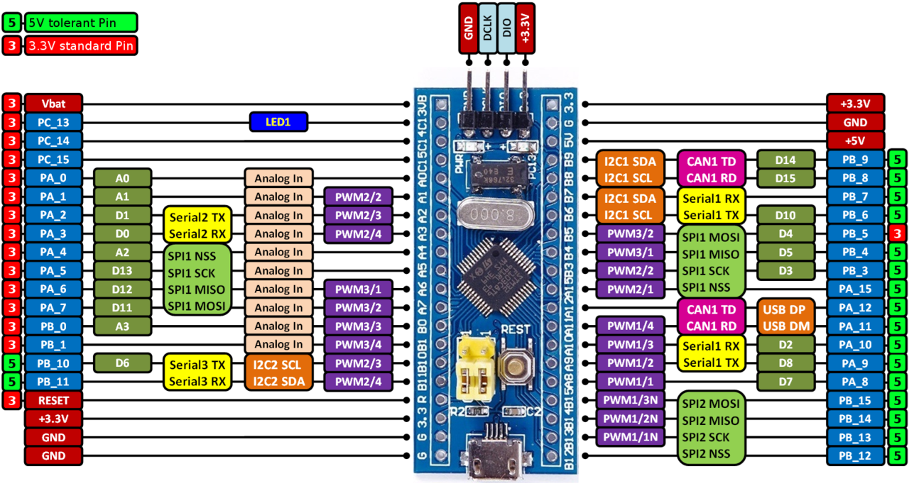

# BluePill-F103C8

Affordable and flexible platform to ease prototyping using a STM32F103C8T6 microcontroller.

- Mbed custom target: BLUEPILL_F103C8
- Board manufacturer: unknown Chinese manufacturers
- MCU: STM32F103C8T6
- MCU manufacturer: STMicroelectronics
- BluePill inherits from STM32F103x8

## Overview

The BluePill board provides an affordable and flexible way for users to try out new ideas and build prototypes with the STM32F103C8T6 microcontroller.

The board features standard 2.54mm pin headers for easy connection to breadboards and other development boards.

The BluePill board requires an external debugger/programmer such as ST-LINK/V2 for programming and debugging.

## Microcontroller features

* STM32F103C8T6 in LQFP48 package
* ARM®32-bit Cortex®-M3 CPU
* 72 MHz max CPU frequency
* VDD from 2.0 V to 3.6 V
* 64 KB Flash
* 20 KB SRAM
* GPIO (37) with external interrupt capability
* 12-bit ADC (2) with 10 channels
* RTC
* Timers (4)
* I2C (2)
* USART (3)
* SPI (2)
* USB 2.0 full-speed
* CAN

## Supported peripherals and features

The BluePill board can be used with various peripherals and modules through its GPIO pins. Common uses include:

* Sensors and actuators via GPIO, I2C, SPI, UART
* USB devices
* CAN bus communication
* ADC for analog sensors
* Timers for PWM and timing applications
* 
* Standard 2.54mm pin headers for breadboard compatibility
* On-board 8MHz crystal oscillator
* On-board reset and boot0 buttons
* On-board power LED and user LED (PC13)
* Flexible board power supply
  + 5V via USB or external source
  + 3.3V regulated on board

## Board pinout

The BluePill board features two rows of 20-pin male headers (2x20) with 2.54mm pitch, providing access to all GPIO pins and peripherals.

You can find more details on the available pins and labels in the **PeripheralPins.c** and **PinNames.h** files.

## Getting started
https://mbed-ce.dev/

## Technical references

For more information, please refer to:

* [STM32F103C8 microcontroller](https://www.st.com/en/microcontrollers-microprocessors/stm32f103c8.html)
* [STM32F103xx reference manual](https://www.st.com/resource/en/reference_manual/rm0008-stm32f101xx-stm32f102xx-stm32f103xx-stm32f105xx-and-stm32f107xx-advanced-armbased-32bit-mcus-stmicroelectronics.pdf)

## Known limitations

The following section describes known limitations for the Mbed platform. For MCU-level limitations and silicon issues, refer to the latest errata sheet for the target MCU.

* Requires external debugger for programming
* Due to the limited memory (64 KB Flash, 20 KB SRAM), this target may not be suitable for large Mbed OS applications. For bigger projects, consider using the bare-metal profile or switching to a target with more memory.

